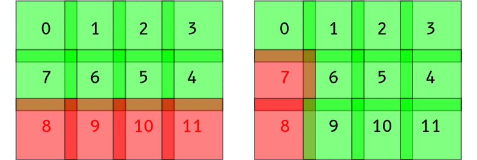

# Automatic Microscope Images Stitching

## Algorithm

To stitch multiple images together, the following image processing algorithms are needed (Brown and Lowe 2007) [^1]:

1. feature extraction with *scale-invariant feature transform* (SIFT)
2. homography estimation or affine transformation with *random sample consensus* (RANSAC)
3. optimization of stitching with *bundle adjustment* and *blending*

One implementation of these algorithms is OpenPano by Wu (2019)[^2].

[^1]: Brown M, Lowe DG. 2007. Automatic panoramic image stitching using invariant features. *IJCV*. 74(1): 59--73.
[^2]: Wu Y. 2019. OpenPano: automatic panorama stitching from scratch. Available at: <https://github.com/ppwwyyxx/OpenPano>.


## Compiling OpenPano

OpenPano source code was written using C++ from scratch without any computer vision library dependency.
In order to run it, the source code must be compiled first.
The following is the compilation command on Ubuntu Linux 18.04.

```bash
# install dependencies
sudo apt install cmake libeigen3-dev

# download and extract
wget https://github.com/ppwwyyxx/OpenPano/archive/master.zip
unzip master.zip

# compile
make -C OpenPano-master/src

# copy to /usr/local
sudo cp OpenPano-master/src/image-stitching /usr/local/bin
sudo cp OpenPano-master/src/config.cfg      /usr/local/etc
```

After successful compilation, there will be a new program named `image-stitching`.
The configuration file `config.cfg` must be copied to the working directory before running this program.


## Configuring OpenPano

OpenPano has three stitching modes, each has different requirement:

- *cylinder*: no camera translation, the images are taken from left to right and must be ordered
- *estimation*: no camera translation, the images could be unordered thus very slow
- *translation*: pure camera translation at the same depth, must be ordered

The default mode for OpenPano is estimation.
But for stitching microscope images purpose, the most appropriate mode is translation.
This is because the images are taken by sliding the object around while the camera is stationary.
The following is the modified configuration file `config.cfg` in order to switch to translation mode.

```
CYLINDER            0
ESTIMATE_CAMERA     0
TRANS               1
ORDERED_INPUT       1
```


## Running OpenPano

In order to get a successful stitching, the input images must be:

- PNG or JPEG format
- ordered sequentially in a snaky manner
- has feature overlap more than 10%

These images must be given filenames that represent their order.
The following figure is an example of the proper ordering sequence.


Before running the program, the `config.cfg` configuration file must be copied to the working directory.
After that, the stitching is started by calling the `image-stitching` program with all of the images filename as parameter.
To get successful stitching, between each image must have feature overlap of more than 10%.
When finished successfully, there will be an output image with the filename of `out.jpg`.

```bash
cp /usr/local/etc/config.cfg .
image-stitching *.png
```

The following figure is an example of input set *Tilia1* that consists of 44 images and its output using translation mode.
Every input image resolution is 1280×960 pixel and resulting in the output image resolution of 5118×3879 pixel.
The image stitching process in translation mode consumes 1.4 minute of CPU time on an Intel Core i7-4770 processor.


Another experiment using estimation mode needs more CPU time of 9.5 minutes.
Although the stitching result is relatively better, but it is very slow that makes this mode impractical for a large amount of input images.
This mode doesn't require the input to be ordered, thus its complexity become quadratic because of pairwise matching for each images.
Other than that, this mode will distort the result image like a lens form.
This is evident at every corner of the result, it is not straight like the original object.


## Vertical Blending


In the result image of translation mode, there are horizontal lines visible at inter-image stitch.
This happens because OpenPano main task is to stitch panoramic image from left to right horizontally, not from top to bottom.
Because of that, vertical blending needs to be added to smooth out the result image in translation mode.
It is done by deleting line 34 from the source code file `src/stitch/blender.cc` like the following.
After that, the modified OpenPano source code must be recompiled.

```diff
@@ -32,5 +32,4 @@
 	if (color.x < 0) continue; \
 	float	w = 0.5 - fabs(c / img.imgref.width() - 0.5); \
-   if (not config::ORDERED_INPUT) /* blend both direction */\
        w *= (0.5 - fabs(r / img.imgref.height() - 0.5)); \
 	color *= w
```

The following figure is the result of translation mode with vertical blending.
The horizontal lines has been disappeared, so the quality is as good as estimation mode without the undesired distortion.
The CPU time is relatively the same as the ordinary translation mode.


## Stitching Error

In the *Tilia1* example above, the program runs without error because every input images has been stitched successfully.
But for many cases, usually there are images that failed to be stitched with previous image.
The following is an example of the error message when the program failed to stitch image number 7 and 8.

```
error: Image 7 and 8 don't match
```

Unfortunately when it failed, the program just exit immediately without doing further correction.
The image that causing this failure is usually has too few features, so it can't be stitched with the next image.
So, additional step is needed to continue the stitching process when error happens.

The first method is simple, for example when image 7 and 8 is failed, then delete image 8 and re-run the stitching program.
This step is repeated until all of the remaining input images are successfully stitched together.
But, after image 8 has been deleted, usually image 7 and 9 will be failed, and so onso this failure will continue until the last image.

To address this problem, the second method will delete the failed image with regards to the last deleted image number.
For example when image 7 and 8 is failed to stitch, then image 8 is deleted as usual.
But then when image 7 and 9 is failed, then image 7 is deleted, because the number is the same as the image that caused the error before.
Using this method, the number of failure is reduced, thus improving the result.
The following is the illustration for both method.



The following table is the comparison of the number of image deleted between both methods.
There are 5 set of input images that will be stitched.
It is clear that the second method is better at handling the stitching error.
For example, the following is the *Tilia5* stitching result using both methods.

: The number of image deleted because of stitching failure

| Input set| Total images   | Method 1 | Method 2 |
| :----    | :------------: | :------: | :------: |
| *Tilia1* |   44           |    0     |    0     |
| *Tilia2* |   45           |    2     |    3     |
| *Tilia3* |   42           |    6     |    2     |
| *Tilia4* |   42           |    2     |    3     |
| *Tilia5* |   48           |    13    |    4     |


The following code is the implemetation of the second method using shell script.
The `image-stitching` program runs repeatedly until there is no more error message, i.e. it stitched together all the remaining images successfully.

```bash
remove_unmatch () {
    img_num=$(grep error err.log | sed -E 's/.* ([0-9]+).*/\1/')    # get unmatch image number

    if [ $img_num = $prev_unmatch ]; then                           # if same as previous unmatch:
        img_num=$((img_num-1))                                      #   select the image before unmatch
    else
        prev_unmatch=$img_num
    fi

    img_file=$(ls *.png | head -n $((img_num+1)) | tail -n 1)       # get its filename
    mv $img_file $img_file.rem                                      # remove it
}

cp /usr/local/etc/config.cfg .
prev_unmatch=1
until image-stitching *.png 2> err.log; do
    remove_unmatch
done
```

## Multiband Blending

Although successfully stitched, the output image looks blurry on some spots.
Multiband blending feature could be used to get sharper detail.
This feature is activated by configuring the `MULTIBAND` line using the number of band desired.
The more band number, the sharper the detail, but it will cost CPU time more.
The following figure shows the difference between normal and 2-band blending translation mode.


But, the overall result as a whole is worse by using this feature.
There are many lines visible separating regions with different contrast level.
These lines could be reduced by increasing the band number, but the processing time will be longer.
The input images should have uniform lighting or contrast setting in order to get the best result.
The following figure is the output image with multiband blending using 16-band and 128-band.
The higher the band number, the better the overall result.


The following table shows the time for multiband blending processing from 0 to 128-band using *Tilia1* image.
For every addition of band number, the processing time increase linearly.
For example, 16-band blending needs 3.7 minutes CPU time or real time 0.5 minute.
The real time is almost 8 times faster because the program is multithreaded using all 8 cores on Intel i7 processor.
The processing load is divided to every thread, so the real time is faster.
The 128-band blending yields the best result with reasonable processing time of 4 minutes in real time.

: Processing time comparison of multiband blending for *Tilia1*

|  Band  | CPU time  | Real time    |
| :----: | :-------: | :----------: |
| 0      |   1:26    |     0:12     |
| 1      |   1:32    |     0:13     |
| 2      |   1:39    |     0:14     |
| 4      |   1:54    |     0:16     |
| 8      |   2:28    |     0:20     |
| 16     |   3:41    |     0:30     |
| 32     |   6:47    |     0:54     |
| 64     |   13:36   |     1:48     |
| 128    |   29:39   |     3:54     |


## Conclusion

The translation mode with vertical blending addition on OpenPano has stitched the microscope images successfully.
When error happens, the problematic image will be deleted with regards to previous error, until all images could be stitched.
The result image detail looks blur in some spots.
It could be sharpened by multiband blending, but the overall result looks fragmented.
This fragmentation could be reduced by increasing the band number, although the processing time will be longer too.
To get the best result possible, the input images must have uniform lighting and contrast.


<!--

remove_unmatch1 () {
    img_num=$(grep error err.log | sed -E 's/.* ([0-9]+).*/\1/')    # get unmatch image number
    img_file=$(ls *.png | head -n $((img_num+1)) | tail -n 1)       # get its filename
    mv $img_file $img_file.rem                                      # remove it
}

Jumlah error

Citra   Metode 2                Metode 1                estimate
------  ----------              ------------------      ---------
1       0                       0                       0
2       3: 38,37,39             2: 38,39                0
3       2: 36,35                6: 36-41                0
4       3: 5,4,6                2: 5,6                  1: 5
5       4: 5,36,35,47           13: 5,36-47             2: 36,47


Metode          Tilia1 (44)     Tilia2 (45)     Tilia3 (42)     Tilia4 (42)     Tilia5 (48)
-------         -----------     ------------    ------------    ------------    -----------
`ESTIMATE`      9:30 (2:02)     9:26 (2:18)     7:34 (2:06)     8:04 (2:35)#    8:11 (1:52)$
`TRANSLATE`     1:26 (0:12)     1:25 (0:12)*    1:14 (0:11)+    1:15 (0:11)##   1:21 (0:11)$$
`TRANSLATE-2`   1:39 (0:14)     1:37 (0:14)*    1:26 (0:12)+    1:26 (0:12)##   1:34 (0:13)$$

                3:54 (1:14)
                5:10 (1:50)

*error: Image 37 and 38 don't match
+error: Image 35 and 36 don't match
#error: Found a tree of size 41!=42, image 5  are not connected well!
##error: Image 4 and 5 don't match
$error: Found a tree of size 46!=48, image 36 47  are not connected well!
$$error: Image 4 and 5 don't match

Intel i7-4770 4C/8T @ 3.40 GHz; SSD

| *Band* | Waktu CPU | Waktu *real* |
| ------ | :-------: | :----------: |
| 0      |   1:26    |     0:12     |
| 1      |   1:32    |     0:13     |
| 2      |   1:39    |     0:14     |
| 4      |   1:54    |     0:16     |
| 8      |   2:28    |     0:20     |
| 16     |   3:41    |     0:30     |
| 32     |   6:47    |     0:54     |
| 64     |   13:36   |     1:48     |
| 128    |   29:39   |     3:54     |


<http://ppwwyyxx.com/2016/How-to-Write-a-Panorama-Stitcher/>
-->
