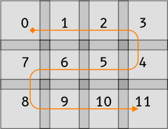
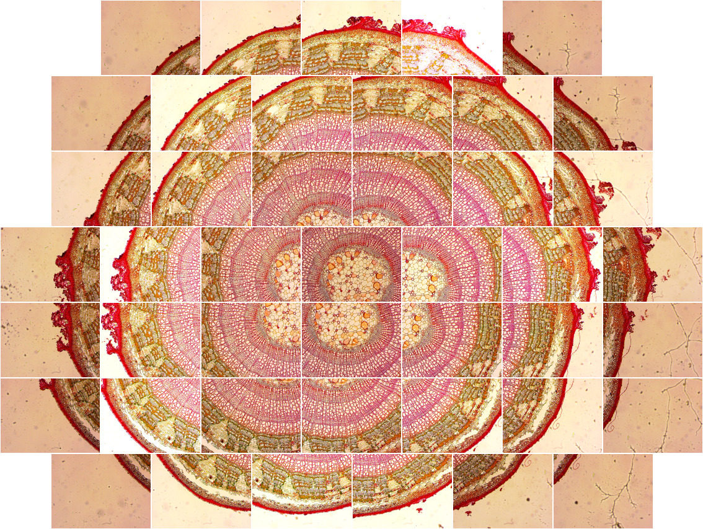
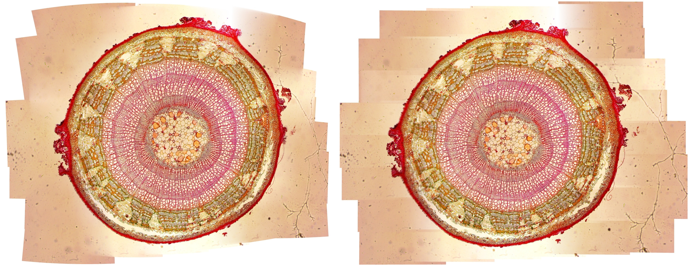
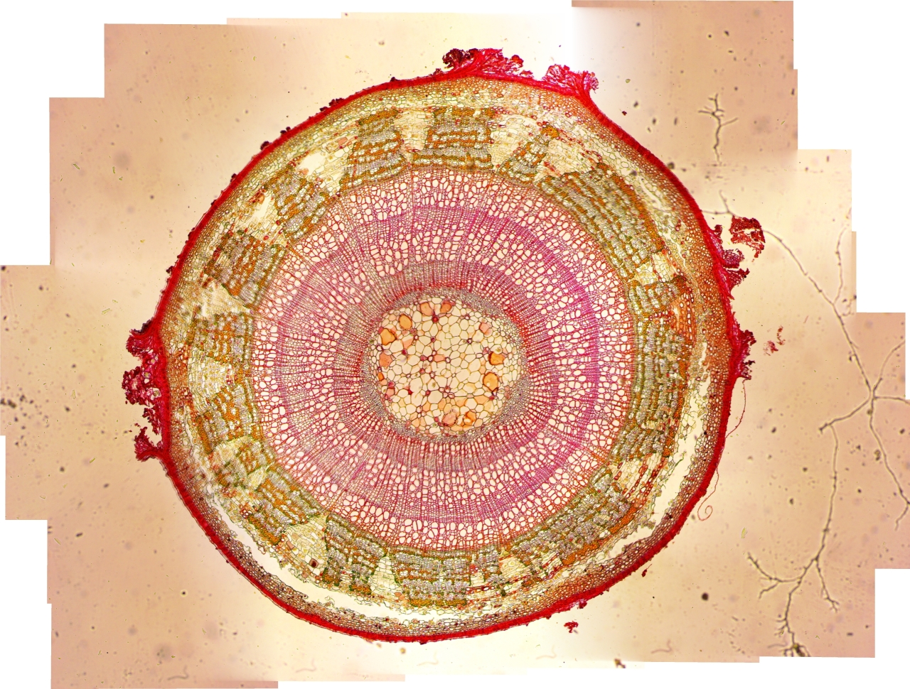
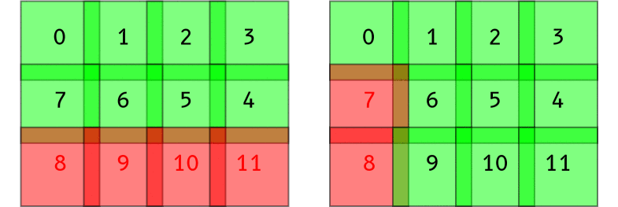
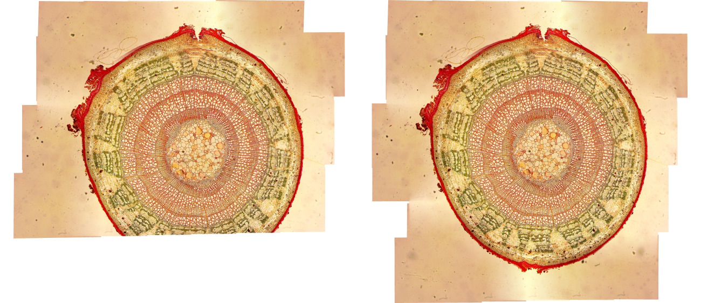
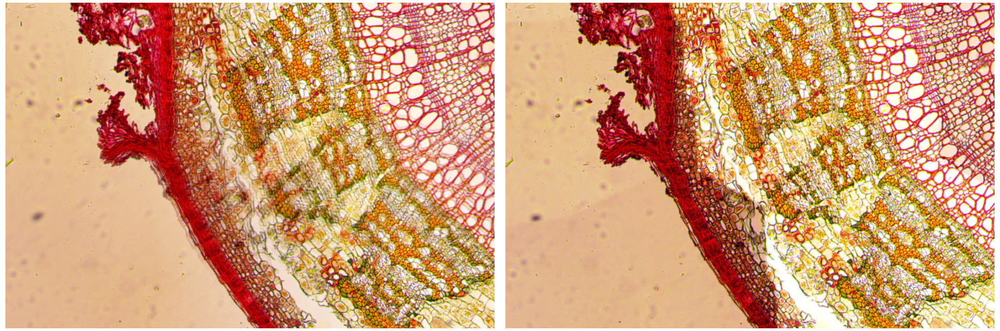
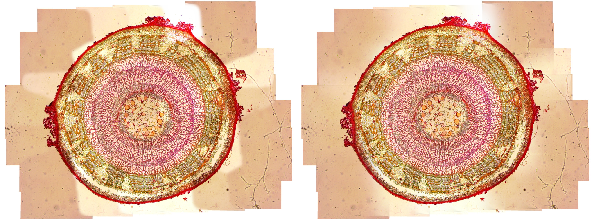
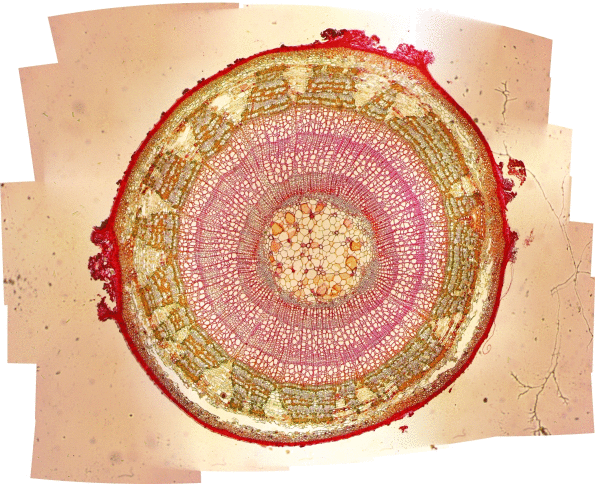

# Penyambungan Otomatis Citra Mikroskop

## Algoritme

Untuk menyambungkan beberapa citra, diperlukan algoritme pengolahan citra berikut (Brown dan Lowe 2007)[^1]:

1. ekstraksi ciri dengan *scale-invariant feature transform* (SIFT)
2. estimasi homografi atau transformasi *affine* dengan *random sample consensus* (Ransac)
3. optimisasi sambungan antar-citra dengan *bundle adjustment* dan *blending*

Salah satu implementasi algoritme ini adalah OpenPano yang ditulis oleh Wu (2019)[^2].

[^1]: Brown M, Lowe DG. 2007. Automatic panoramic image stitching using invariant features. *IJCV*. 74(1): 59--73.
[^2]: Wu Y. 2019. OpenPano: automatic panorama stitching from scratch. Tersedia pada: <https://github.com/ppwwyyxx/OpenPano>.


## Kompilasi OpenPano

Kode sumber OpenPano ditulis dengan bahasa C++ dari dasar.
Sebelum bisa menjalankannya, kode sumber tersebut harus dikompilasi terlebih dahulu.
Berikut perintah kompilasinya pada Ubuntu Linux 18.04.

```bash
# instal dependensi
sudo apt install cmake libeigen3-dev

# unduh dan ekstrak
wget https://github.com/ppwwyyxx/OpenPano/archive/master.zip
unzip master.zip

# kompilasi
make -C OpenPano-master/src

# salin hasilnya ke direktori /usr/local
sudo cp OpenPano-master/src/image-stitching /usr/local/bin
sudo cp OpenPano-master/src/config.cfg      /usr/local/etc
```

Setelah kompilasi berhasil, akan didapatkan program baru dengan nama `image-stitching`.
*File* konfigurasi `config.cfg` harus disalin ke direktori kerja sebelum menjalankan program.


## Konfigurasi OpenPano

OpenPano memiliki pilihan tiga mode penyambungan dengan syaratnya:

- silinder: tidak ada perpindahan pada kamera, citra diambil dari kiri ke kanan dan harus terurut
- estimasi: tidak ada perpindahan pada kamera, citra tidak terurut namun lebih lambat
- translasi: kamera hanya melakukan perpindahan dengan kedalaman citra sama, citra harus terurut

Mode *default* OpenPano adalah estimasi.
Namun, untuk kasus penyambungan citra mikroskop, lebih tepat digunakan mode translasi.
Hal ini karena citra mikroskop diambil dengan cara menggeser-geser objek.
Berikut perubahan konfigurasi pada *file* `config.cfg` untuk beralih ke mode translasi.

```
CYLINDER            0
ESTIMATE_CAMERA     0
TRANS               1
ORDERED_INPUT       1
```


## Menjalankan OpenPano

Syarat citra masukan:

- format PNG atau JPEG
- terurut secara bersambung (mengular)
- beririsan ciri minimal 10%

Citra harus diberikan nama *file* yang menggambarkan urutannya.
Berikut adalah contoh urutan citra yang benar.



Sebelum menjalankan program, *file* konfigurasi `config.cfg` harus disalin dahulu ke direktori kerja.
Kemudian, penyambungan citra dilakukan dengan memanggil program `image-stitching` dengan parameter semua nama citra yang akan disambung.
Untuk dapat tersambung dengan baik, antara kedua citra harus beririsan ciri minimal 10%.
Setelah berhasil, akan dihasilkan citra keluaran dengan nama *file* `out.jpg`.

```bash
cp /usr/local/etc/config.cfg .
image-stitching *.png
```

Berikut contoh citra masukan *Tilia1* yang terdiri atas 44 citra dan hasil keluarannya dengan menggunakan konfigurasi mode translasi.
Tiap citra masukan berdimensi 1280×960 piksel. Citra keluaran berdimensi 5118×3879 piksel.
Proses penyambungan citra mode translasi membutuhkan waktu CPU sebesar 1.4 menit pada prosesor Intel Core i7-4770 3.40 GHz.





Percobaan pada mode estimasi memerlukan waktu CPU yang lebih lama sebesar 9.5 menit.
Meskipun hasil sambungannya relatif lebih bagus, namun waktu yang sangat lama membuat mode estimasi tidak praktis untuk jumlah citra masukan yang banyak.
Mode estimasi tidak mensyaratkan citra harus terurut, akibatnya kompleksitas menjadi kuadratik karena harus melakukan *pairwise matching* pada tiap citra masukan.
Selain itu, mode estimasi akan mendistorsi citra hasil seperti bentuk lensa.
Hal ini terlihat dari bentuk citra yang melengkung terutama pada bagian pinggir, sehingga tidak lurus lagi seperti yang diharapkan.


## *Blending* Vertikal

Pada citra hasil mode translasi terlihat garis-garis mendatar pada sambungan antar-citra.
Hal ini karena tujuan awal OpenPano adalah untuk menyambungkan citra panorama dari kiri ke kanan secara horizontal, bukan dari atas ke bawah.
Oleh karena itu, diperlukan penambahan *blending* secara vertikal pada mode translasi dengan cara menghapus kode program baris ke-34 pada *file* `src/stitch/blender.cc` seperti di bawah ini.
Setelah itu kode program OpenPano dikompilasi ulang.

```diff
@@ -32,5 +32,4 @@
 	if (color.x < 0) continue; \
 	float	w = 0.5 - fabs(c / img.imgref.width() - 0.5); \
-   if (not config::ORDERED_INPUT) /* blend both direction */\
        w *= (0.5 - fabs(r / img.imgref.height() - 0.5)); \
 	color *= w
```

Berikut adalah hasil mode translasi dengan penambahan *blending* vertikal.
Garis mendatar pada hasil sebelumnya sudah hilang, sehingga kualitasnya sama dengan mode estimasi.
Waktu CPU yang dibutuhkan pun relatif sama dengan metode translasi biasa.




## Kegagalan Penyambungan

Pada contoh di atas, program berjalan dengan sukses karena semua citra berhasil disambungkan.
Namun, pada banyak kasus terdapat citra yang gagal disambungkan dengan citra sebelumnya.
Berikut contoh pesan kesalahan program jika menemukan kasus kegagalan tersebut.

```
error: Image 7 and 8 don't match
```

Sayangnya jika terjadi kegagalan, program akan langsung keluar tanpa melakukan langkah lebih lanjut.
Citra yang gagal disambungkan biasanya memiliki fitur yang sedikit, sehingga tidak bisa disambungkan dengan citra berikutnya.
Oleh karena itu, diperlukan metode tambahan untuk melanjutkan proses penyambungan jika terjadi kegagalan.

Metode pertama sederhana, misalnya jika terdapat kegagalan penyambungan antara citra 7 dan 8, maka hapus citra nomor 8 dan jalankan kembali penyambungan dari awal.
Demikian seterusnya sampai menyisakan kumpulan citra yang berhasil tersambung semuanya.
Namun biasanya setelah citra 8 dihapus, citra 7 dan 9 akan gagal juga disambungkan, sehingga kegagalan akan berlanjut sampai akhir.

Untuk mengatasinya, diperlukan metode baru dalam mengatasi kegagalan penyambungan.
Metode kedua akan menghapus dengan mempertimbangkan nomor citra yang sudah dihapus sebelumnya.
Misalnya citra 7 dan 8 gagal disambungkan, maka citra nomor 8 dihapus seperti biasa.
Selanjutnya jika citra 7 dan 9 gagal disambungkan, maka citra nomor 7 yang akan dihapus, karena nomornya sama dengan nomor citra yang gagal sebelumnya.
Dengan metode ini, jumlah citra yang dihapus menurun sehingga hasil akhirnya lebih bagus.
Berikut ilustrasi proses kedua metode tersebut.



Perbandingan jumlah citra yang dihapus pada kedua metode dapat dilihat pada tabel berikut.
Terdapat 5 set citra yang akan disambungkan, dapat dilihat bahwa metode kedua lebih baik dalam menangani kegagalan penyambungan.
Contohnya dapat dilihat pada hasil penyambungan citra *Tilia5* berikut ini.

: Perbandingan jumlah citra yang dihapus karena gagal disambung

| Citra    | Jumlah masukan | Metode 1 | Metode 2 |
| :------- | :------------: | :------: | :------: |
| *Tilia1* |   44           |    0     |    0     |
| *Tilia2* |   45           |    2     |    3     |
| *Tilia3* |   42           |    6     |    2     |
| *Tilia4* |   42           |    2     |    3     |
| *Tilia5* |   48           |    13    |    4     |



Berikut adalah implementasi metode kedua dengan menggunakan *shell script*.
Program `image-stitching` akan dijalankan terus menerus hingga tidak ada lagi pesan kesalahan.

```bash
remove_unmatch () {
    img_num=$(grep error err.log | sed -E 's/.* ([0-9]+).*/\1/')    # get unmatch image number

    if [ $img_num = $prev_unmatch ]; then                           # if same as previous unmatch:
        img_num=$((img_num-1))                                      #   select the image before unmatch
    else
        prev_unmatch=$img_num
    fi

    img_file=$(ls *.png | head -n $((img_num+1)) | tail -n 1)       # get its filename
    mv $img_file $img_file.rem                                      # remove it
}

cp /usr/local/etc/config.cfg .
prev_unmatch=1
until image-stitching *.png 2> err.log; do
    remove_unmatch
done
```

## *Multiband Blending*

Meskipun berhasil disambungkan, namun detail citra yang dihasilkan masih ada yang samar di beberapa titik.
Untuk memperoleh detail yang tajam, dapat digunakan fitur *multiband blending*.
Fitur ini diaktifkan dengan mengatur konfigurasi `MULTIBAND` dengan nilai *band* yang diinginkan.
Semakin besar jumlah *band*, semakin halus hasil sambungannya, namun akan menambah waktu CPU.
Berikut contoh perbedaan detail antara mode translasi biasa dan mode translasi dengan 2-*band blending*.



Namun, hasil akhir secara keseluruhan dengan fitur ini menjadi lebih buruk.
Terlihat garis-garis pemisah antar-sambungan citra karena perbedaan kontras pada citra masukan.
Garis-garis ini dapat disamarkan dengan menambah jumlah *band*, namun waktu pemrosesan menjadi lebih lama.
Kualitas keluaran fitur ini akan lebih baik jika semua citra masukan memiliki pencahayaan atau kontras yang seragam.
Berikut hasil citra keluaran secara keseluruhan dengan fitur *multiband blending* sejumlah 16 dan 128 *band*.
Terlihat bahwa semakin banyak jumlah *band*, hasil keseluruhan semakin bagus.



Tabel berikut menunjukkan waktu yang dibutuhkan untuk pemrosesan *multiband blending* dari 0 hingga 128 *band* untuk citra *Tilia1*.
Dapat dilihat terjadi penambahan waktu CPU secara linear setiap penambahan jumlah *band*.
Misalnya untuk 16-*band* dibutuhkan waktu CPU 3.7 menit atau waktu *real* 0.5 menit.
Waktu *real* hampir 8 kali lebih cepat karena CPU Intel i7 yang digunakan memiliki 8 *thread*.
Beban kerja CPU dibagi ke tiap *thread*, sehingga waktu *real*-nya lebih cepat.
Untuk hasil yang bagus dengan 128-*band*, dibutuhkan waktu pemrosesan yang lama sekitar 30 menit waktu CPU.

: Perbandingan waktu pemrosesan *multiband blending* citra *Tilia1*

| *Band* | Waktu CPU | Waktu *real* |
| :----: | :-------: | :----------: |
| 0      |   1:26    |     0:12     |
| 1      |   1:32    |     0:13     |
| 2      |   1:39    |     0:14     |
| 4      |   1:54    |     0:16     |
| 8      |   2:28    |     0:20     |
| 16     |   3:41    |     0:30     |
| 32     |   6:47    |     0:54     |
| 64     |   13:36   |     1:48     |
| 128    |   29:39   |     3:54     |


## Simpulan

Mode translasi dengan tambahan *blending* vertikal pada OpenPano berhasil menyambungkan citra mikroskop dengan baik.
Apabila terjadi kegagalan, maka citra yang menyebabkan gagal akan dihapus dengan
mempertimbangkan kegagalan sebelumnya, hingga citra dapat disambungkan semuanya.
Detail hasil citra keluaran dapat dipertajam dengan fitur *multiband blending*, namun hasil akhirnya menjadi terfragmentasi.
Fragmentasi dapat disamarkan dengan menambah jumlah *band*, namun akan memperlama proses penyambungan.
Sebaiknya semua citra masukan memiliki pencahayaan dan kontras yang seragam agar tidak terjadi fragmentasi.



<!--

remove_unmatch1 () {
    img_num=$(grep error err.log | sed -E 's/.* ([0-9]+).*/\1/')    # get unmatch image number
    img_file=$(ls *.png | head -n $((img_num+1)) | tail -n 1)       # get its filename
    mv $img_file $img_file.rem                                      # remove it
}

Jumlah error

Citra   Metode 2                Metode 1                estimate
------  ----------              ------------------      ---------
1       0                       0                       0
2       3: 38,37,39             2: 38,39                0
3       2: 36,35                6: 36-41                0
4       3: 5,4,6                2: 5,6                  1: 5
5       4: 5,36,35,47           13: 5,36-47             2: 36,47


Metode          Tilia1 (44)     Tilia2 (45)     Tilia3 (42)     Tilia4 (42)     Tilia5 (48)
-------         -----------     ------------    ------------    ------------    -----------
`ESTIMATE`      9:30 (2:02)     9:26 (2:18)     7:34 (2:06)     8:04 (2:35)#    8:11 (1:52)$
`TRANSLATE`     1:26 (0:12)     1:25 (0:12)*    1:14 (0:11)+    1:15 (0:11)##   1:21 (0:11)$$
`TRANSLATE-2`   1:39 (0:14)     1:37 (0:14)*    1:26 (0:12)+    1:26 (0:12)##   1:34 (0:13)$$

                3:54 (1:14)
                5:10 (1:50)

*error: Image 37 and 38 don't match
+error: Image 35 and 36 don't match
#error: Found a tree of size 41!=42, image 5  are not connected well!
##error: Image 4 and 5 don't match
$error: Found a tree of size 46!=48, image 36 47  are not connected well!
$$error: Image 4 and 5 don't match

Intel i7-4770 4C/8T @ 3.40 GHz; SSD

| *Band* | Waktu CPU | Waktu *real* |
| ------ | :-------: | :----------: |
| 0      |   1:26    |     0:12     |
| 1      |   1:32    |     0:13     |
| 2      |   1:39    |     0:14     |
| 4      |   1:54    |     0:16     |
| 8      |   2:28    |     0:20     |
| 16     |   3:41    |     0:30     |
| 32     |   6:47    |     0:54     |
| 64     |   13:36   |     1:48     |
| 128    |   29:39   |     3:54     |


<http://ppwwyyxx.com/2016/How-to-Write-a-Panorama-Stitcher/>
-->
